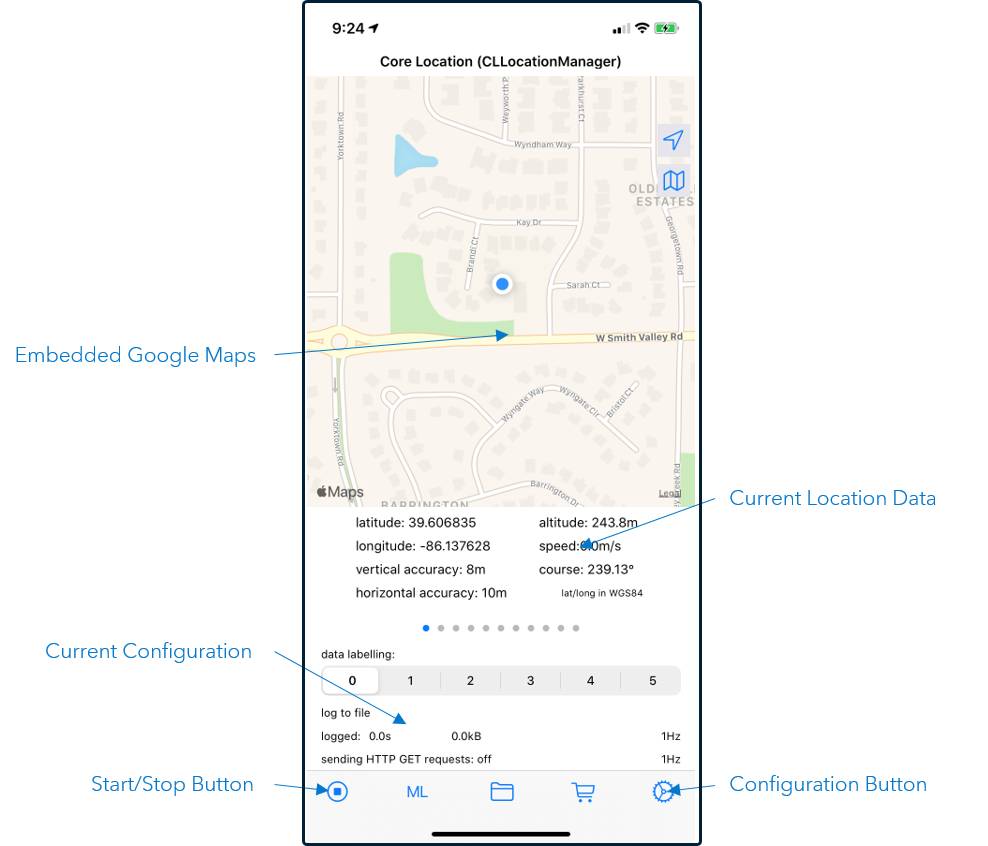

# Monitoring School Zone Speed with ESP

## Table of Contents

* [Overview](#overview)
	* [iPhone 11 Location Services](#iphone-11-location-services)
	* [SensorLog](#sensorlog)
		* [SensorLog Home Screen](#sensorlog-home-screen)
		* [SensorLog Configuration Screen](#sensorlog-configuration-screen)
	* [Socket Connection](#socket-connection)
	* [Geofences and Polylines](#geofences-and-polylines)
		* [Geofence Overview](#geofence-overview)
		* [Polylines](#polylines)
		* [Polyline Examples](#polyline-examples)
	* [Project Description](#project-description)
		* [inputGPS Source Window](#inputgps-source-window)
		* [convertToImperial Compute Window](#converttoimperial-compute-window)
		* [errors Copy Window](#errors-copy-window)
		* [schoolZones Source Window](#schoolzones-source-window)
		* [monitorSchoolZones Geofence Window](#monitorschoolzones-geofence-window)
		* [inSchoolZone Filter Window](#inschoolzone-filter-window)
		* [changeToInsert Remove State Window](#changetoinsert-remove-state-window)
		* [violations Pattern Window](#violations-pattern-window)
		* [sendWarning Notification Window](#sendwarning-notification-window)
	* [Prerequisites](#prerequisites)
	* [Installation](#installation)
		* [Download Files from GitHub](#download-files-from-github)
		* [Create Server Directory](#create-server-directory)
		* [Upload Files](#upload-files)
	* [Running](#running)
	* [Examples](#examples)
* [Contributing](#contributing)
* [License](#license)
* [Additional Resources](#additional-resources)

## Overview

Welcome to the Monitoring School Zone Speed project. This example uses the iPhone 11 Location Services to simulate a GPS device. Polylines are used to identify school zones where the speed limit is 25 MPH. When the device enters a school zone its speed is monitored. If the speed exceeds 30 MPH for five seconds a warning e-mail message is sent to the owner of the device.

The following is a list of learning objectives for the Monitoring School Zone Speed project:

- How to surface sensor data for an iPhone 11.
- How to use a socket connection to publish data to ESP.
- How to use polylines as a trip wire or boundary

### iPhone 11 Location Services

The iPhone 11 includes a Global Positioning System (GPS) chip that functions like the chip in stand-alone GPS devices. Because GPS signals are not always strong (e.g., inside building), signals from cellular towers and Wi-Fi networks are also used in a system called assisted GPS. This allows iPhone 11 Location Services to determine the location of the device quickly and accurately.

In addition to geographic location, Location Services determine the altitude and orientation of the device. Location Services uses all the available components on the device including:

- GPS
- Wi-Fi
- Bluetooth
- Magnetometer
- Barometer
- Cellular Hardware

The following table lists the Location Services data items available and provides a brief description of each:

| Data Item | Description |
| ------ | ------ |
| Datetime | The date and time the location was determined in UNIX EPOCH time. |
| Latitude | The latitude of the device in degrees. |
| Longitude | The longitude of the device in degrees. |
| Altitude | The altitude of the device in meters. |
| Speed | The speed at which the device is travelling in meters per second. |
| Course | The direction in which the device is moving in degrees. |
| Floor | The floor of the building on which the device is located if floor information is available. |
| Horizontal accuracy | The radius of uncertainty for the location, measured in meters. A negative value indicates that the latitude and longitude are invalid. |
| Vertical accuracy | A zero or positive number indicates the value in the altitude property is plus or minus the specified number of meters. A negative value indicates that the altitude value is invalid. |

### SensorLog

SensorLog is an iPhone app developed by Dr. Bernd Thomas that reads and collects data from the sensors on the device. It can write the information to a file (csv or JSON) or stream the data by way of a socket connection to a user-specified server.

SensorLog reads the following types of sensor information. You can select which items to include:

- Device orientation
- Battery level
- Position (i.e., location)
- Heading
- Accelerometer
- Gyroscope
- Device motion
- Activity
- Pedometer
- Altimeter
- Audio level

#### SensorLog Home Screen

_Figure 1 - SensorLog Home Screen_

> NOTE: Location Services must be turned on and SensorLog must have permission to access the device’s location. Refer to the [Apple Support](https://support.apple.com/en-us/HT207092) site for instructions.

The SensorLog home screen provides current information and buttons to control the app. The top of the screen displays the current location of the device on an embedded Google Maps. Under the map is the device’s current location values as provided by Location Services.

The current configuration is displayed near the bottom of the screen. Finally, there is a menu bar at the bottom that includes a Start/Stop button and a button to access the configuration.

#### SensorLog Configuration Screen

_Figure 2 - SensorLog Configuration Screen Page 1_

The Configuration screen is accessed by way of the Configuration button on the SensorLog home screen. This is where you configure how SensorLog surfaces the sensor data.

The Logging Settings are found at the top of the Configuration screen. This is where you set the logging format and rate, and where you select the log to file or log to stream toggle. 

If `log to stream` is selected, you will need to configure the Streaming Settings. Refer to the section, Configure SensorLog to Stream Information, for more information.

_Figure 3 - SensorLog Configuration Screen Page 2_

You can access the Sensors and Data section of Configuration by scrolling down. This is where you select which data items to include in the stream or file.

### Socket Connection

This project uses a socket connection to publish events from SensorLog on the iPhone 11 device to the inputGPS source window in SAS ESP. When the ESP connector implements a socket connection, it might act as a client or server. When the connector specifies only the port number (e.g., :55555) it implements the server and the network peer (SensorLog) is the client.

_Figure 4 - Socket Connection_

The server (ESP) includes a socket that is bound to a specific port number. When the project is running ESP is listening to the socket for a connection request from a client.

The client (SensorLog) knows the IP Address and port number on which the server is listening. It initiates a connection request which is accepted by the server. The server makes the connection and events can now be published from the client to the server.

The following shows the connector configuration for a socket connector acting as a server:

_Figure 5 - Socket Connector Configuration_

### Geofences and Polylines

#### Geofence Overview

_Figure 6 - Geofence_

A geofence is a virtual perimeter around a real-world geographic area. It has two input sources, position and geometries. The position source window streams the geographic positions of one or more objects. The geometries source window provides definitions for areas of interest, or geometries.

The geofence window functions like a left outer join with the position source being the left side of the join and the geometries source acting as the right side. Position data is always output. However, geometry data is output only when the position is within the perimeter defined by the geofence.

There are three types of geometries used to form a geofence:

- Circle – Set of coordinates (center point) surrounded by a radius.
- Polygon – Multiple sets of coordinates forming a closed ring.
- Polyline – Multiple sets of coordinates forming a trip wire or boundary.

#### Polylines

A polyline is a shape that defines a border or trip wire. It is comprised of multiple sets of coordinates that form one or more segments. The following figure shows the components when processing a polyline:

_Figure 7 - Polyline Components_

The above polyline includes four points, P1 through P4. The order of the coordinate sets in the polyline definition determines the order of the points. Point P1 is considered the origin of the polyline. Because there are four points, there are three segments. Segment 1 is formed by connecting points P1 and P2, segment 2 by connecting P2 and P3, and segment 3 by connecting P3 and P4.

The polyline has a radius defined of 50 meters. If polyline strict projection is enabled, a perpendicular line is drawn at points P1 and P4 and the portion of the radius outside the line is excluded. If any position is within the radius (not counting for strict projection) the Geometry ID and all other output fields are included in the output event.

When a position is within the radius, the distance to the closest segment is calculated. If the position is to the left of the polyline the distance value is negative. If to the right the value is positive. This allows you to detect to which side of the polyline the position lies. The distance to the origin (i.e., P1) is also calculated.

#### Polyline Examples

This project uses polylines to define school zones. This is accomplished by determining if the position is within the radius, the closest segment of the polyline, and whether the distance value is positive or negative.

The following figure shows several examples of vehicles near or in the school zone. The table that follows the figure shows the results of evaluating whether the vehicle is in the school zone. Polyline strict projection is enabled.

_Figure 8 - Polyline Examples_

| Vehicle | Geometry ID Returned | Closest Segment | Distance | In Speed Zone |
| ------ | ------ | ------ | ------ | ------ |
| A | No | N/A | N/A | No |
| B | No | N/A | N/A | No |
| C | Yes | 1 | Positive | No |
| D | Yes | 3 | Negative | No |
| E | Yes | 1 | Negative | Yes |
| F | Yes | 2 | Negative | Yes |
| G | Yes | 3 | Positive | Yes |

### Project Description

Here is the project in ESP Studio. 

_Figure 9 - ESP Project_

#### inputGPS Source Window

The **inputGPS** source window inserts the iPhone Location Services data. This is the SensorLog data in csv format by way of a socket connection or file. The window includes two input data connectors, one for the socket connection and one for the csv file. You can select which input data connector to use.

The following shows the schema for the **inputGPS** source window:

_Figure 10 - inputGPS Source Window Schema_

#### convertToImperial Compute Window

The **convertToImperial** compute window creates several new fields using expressions. The window passes through the `id`, `locDatetime`, `vendorID`, `locLatitude`, and `locLongitude` fields. The following table shows the created fields and the expressions used to populate them:

| New Field | Expression |
| ------ | ------ |
| speedMPH | locSpeed * 2.23694 |
| compassDir | if (locCourse >= 315) or (locCourse < 45) then return "N" else if (locCourse >= 45) and (locCourse < 135) then return "E" else if (locCourse >= 135) and (locCourse < 225) then return "S" else return "W" |
| altitudeFt | locAltitude * 3.28084 |
| locationError | if locHorAcc >= 0 and locHorAcc <= 20 and locVerAcc >= 0 and locVerAcc <= 20 then return 0 else return 1 |

The field `locationError` is used to control splitting the output. There are two output slots, one as input to the **monitorSchoolZone** geofence window (slot 0) and one to the **errors** copy window (slot 1). This removes any events with invalid or inaccurate values from the normal flow of the project.

#### errors Copy Window

The **errors** copy window receives any events from the **convertToImperial** window where the horizontal or vertical accuracy are out of tolerance. The window retains the most recent hour of error events.

#### schoolZones Source Window

The **schoolZones** source window reads the polyline definitions from the `school_zone2.csv` file. The output of this window is used as the geometries input to the **monitorSchoolZones** geofence window.

The following shows the schema for the **schoolZones** source window:

_Figure 11 - schoolZones Source Window Schema_

#### monitorSchoolZones Geofence Window

The **monitorSchoolZones** geofence window receives positional input from slot 0 of the **convertToImperial** compute window. It receives geometric information from the **schoolZones** source window. Polygon strict projection is enabled.

The following figure shows the output map for the **monitorSchoolZones** window. Whenever a position is within the defined radius of 50 meters, the `Geometry ID` and all other output fields are populated:

_Figure 12 - monitorSchoolZones Geofence Window Output Map_

#### inSchoolZone Filter Window

The **inSchoolZone** filter window passes through events when the position is within a defined school zone . All other events are filtered. The following is the expression used to pass through events when the position is in a school zone:

~~~
geoid != ''  AND 
(
(closest  == 1 and geodist < 0)  OR 
(closest == 2) OR
(closest == 3 and geodist > 0)
)
~~~

#### changeToInsert Remove State Window

The **changeToInsert** window receives events for the **inSchoolZone** filter window, converts them to inserts, and outputs the events to the **violations** pattern window. This window is required because a filter window can output inserts, updates, deletes, and upserts and a pattern window requires inserts only.

#### violations Pattern Window

The **violations** Pattern window is used to detect speeding violations (speed in excess of 30 MPH) when a vehicle is in a school zone. The pattern is looking for five unique events where the speed is greater than 30 MPH.

The following figure shows the `detectSpeeding` pattern used by the **violations** pattern window:

_Figure 13 - violations Pattern Window detectSpeeding Pattern_

The `detectSpeeding` pattern uses `vendorID` as the index field. This means the `vendorID` must be the same in all events of interest.

Each of the five events of interest (EOI) use the same expression, `(speedMPH > 30)`. The logic is as follows:

~~~
fby(is(e1),is(e2),is(e3),is(e4),is(e5))
~~~

The `fby` operator requires the first operand to be true, followed by the second operand, and so on. The EOIs must occur in sequence and each EOI must have a unique event applied to it. The `is` operator requires the EOI to be true and then fixes it so that no other events are applied to the EOI. 

What this all means is that for the pattern to be true, there must be five unique events over 30 MPH in sequence.

#### sendWarning Notification Window

The **sendWarning** Notification window delivers a warning e-mail message when a school zone speeding violation occurs. For this project, the messages are written only to the server console. The throttle value for the window is set to send one message per minute, regardless of the number of input events.

For additional information about Notification windows, refer to the [Using Notification Windows](https://go.documentation.sas.com/?cdcId=espcdc&cdcVersion=6.2&docsetId=espcreatewindows&docsetTarget=n0iyj428gntld5n1jnjcrn3ivbtc.htm&locale=en) section of the SAS ESP 6.2 documentation.

### Prerequisites

- SAS Event Stream Processing 6.2
- SensorLog app for iPhone 11

### Installation

#### Download Files from GitHub

All files required to execute the project are available in the [files](files) directory of this page. Download the following files:

- [school_zones.csv](files/school_zones.csv) – Polyline definitions for school zones
- [gps_input.csv](files/gps_input.csv) – Input data file recorded from SensorLog
- [sensor_log.xml](files/sensor_log.xml) – ESP project
- [run_polyline.sh](files/run_polyline.sh) – Startup script to execute ESP project
- [dashboard.xml](files/dashboard.xml) – ESP Streamviewer dashboard

#### Create Server Directory

Create a server directory for the project’s files. The following is an example of the command to create a directory:

~~~
mkdir /home/zestem/polyline
~~~

#### Upload Files

Upload all the files to the directory you created. Change the permission of the `run_polyline.sh` startup script so it is executable. The following is an example of the command to do this:

~~~
chmod 777 /home/zestem/ployline/run_polyline.sh
~~~

### Running

This project includes a project file, sensor_log.xml, you can execute. The project includes two input data connectors, one to read a csv file and the other to use in a socket connection. Instructions for both are included in the following sections.

- [Execute the project from the Command Line](doc/command_line/readme.md)
- [Execute the project with SAS ESP Studio](doc/esp_studio/readme.md)
- [Making a Socket Connection](doc/socket_connector/readme.md)

### Examples

_Execute the project at the Command Line_

_Execute the project with SAS ESP Studio_

_Making a Socket Connection_

## Contributing

> We welcome your contributions! Please read [CONTRIBUTING.md](CONTRIBUTING.md) for details on how to submit contributions to this project. 

## License

> This project is licensed under the [Apache 2.0 License](LICENSE).

## Additional Resources

* [SAS Event Stream Processing 6.2 Documentation](https://go.documentation.sas.com/?cdcId=espcdc&cdcVersion=6.2&docsetId=espov&docsetTarget=home.htm&locale=en)

