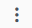
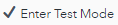
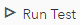
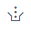
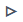

# Execute the project with SAS ESP Studio

## Table of Contents

* [Import Dashboard into ESP Streamviewer](#import-dashboard-into-esp-streamviewer)
* [Upload project to SAS ESP Studio](#upload-project-to-sas-esp-studio)
* [Edit Input Data Connectors](#edit-input-data-connectors)
* [Test the project](#test-the-project)
* [Execute the project on the ESP server](#execute-the-project-on-the-esp-server)

The following section discusses executing the project using SAS ESP Studio. Instructions are also included in a later section for [executing the project using the command line](doc/command_line/readme.md).

## Import Dashboard into ESP Streamviewer

The dashboard for ESP Streamviewer is imported before the project is executed. The is to prepare Streamviewer for the streams. You can use the following steps to import the Monitor School Zones dashboard using SAS ESP Streamviewer.

1.	Start SAS ESP Streamviewer.
    A new dashboard appears.

2.	Click   to open the Import Data screen.

    

    _Figure 1 - Import Data Screen_

3.	Select **File**, and then **Choose File**. Select the `dashboard.xml` file you downloaded. Click **OK** to import the dashboard.

## Upload project to SAS ESP Studio

You need to upload the `sensor_log.xml` file to SAS ESP Studio to access it there.

1.	In the upper-right corner of SAS ESP Studio, click  to reveal the **More actions** menu and select **Upload projects**.
    _The Upload Projects screen appears._

    

    _Figure 2 - Upload Projects Screen_

2.	Click .

3.	Navigate to the `sensor_log.xml` file and click **Open**.

4.	Click **Upload**. The file is uploaded, and the **Upload Projects** window displays the file, project name, and a green checkmark if the upload was successful.

5.	Click **Close** to close the **Upload Projects** window. The project appears using the Project Name specified in the project.

6.	Double-click the project to open it.

## Edit Input Data Connectors

You must edit any Input Data (Publisher) Connectors and to specify the path to the files you uploaded.

1.  Click the **inputGPS** source window to select it.

2.	Expand the **Input Data (Publisher) Connectors** section.

4.	Select the `Csv_connector` and click  to open the **Connector Configuration** window.

    

    _Figure 3 - Input Data Connector Configuration Screen_

5.	Edit the **Fsname** field to include the full path to the file.

6.	Click **OK** to close the **Connector Configuration** window.

7.  Repeat steps 1 - 6 for the `Zones_connector` for the **schoolZones** window.

## Test the project

SAS ESP Studio allows you to test a project.

1.	Ensure the project is open in ESP Studio.

2.	If necessary, click  to save your changes. A project must be saved before it can be tested.

3.	Click  to open the **Test** window.

    

    _Figure 4 - Test Window_

4.	Click  to begin the test. The project will start on the server and the connectors will begin publishing and subscribing.

    

    _Figure 5 - Test Executing_

5.	Click any of the tabs to view the output from that window.

6.	To stop the test, click .

## Execute the project on the ESP server

You can use the ESP Servers feature of SAS ESP Studio to execute a project on the ESP XML Server.

1.	Click **ESP Servers** to display the ESP Servers screen.

    

    _Figure 6 - ESP Servers Screen_

2.	On the bottom half of the screen, click  (Load project) to display the **Load Project** screen.

    

    _Figure 7 - Load Project Screen_

3.	Select the `sensor_log` project and click **Load**.
_The project appears under Projects on the ESP Servers screen._

4.	Click the project to select it, and then click  to start the project on the SAS ESP Server. The status indicator turns green.

5.  Switch to ESP Streamviewer. The dashboard should be displaying information. You may need to click  to refresh the dashboard.

    

    _Figure 8 - Monitor School Zones Dashboard_
