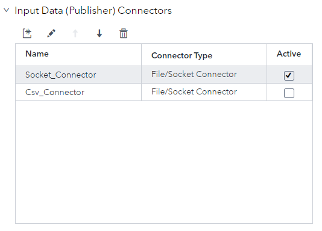
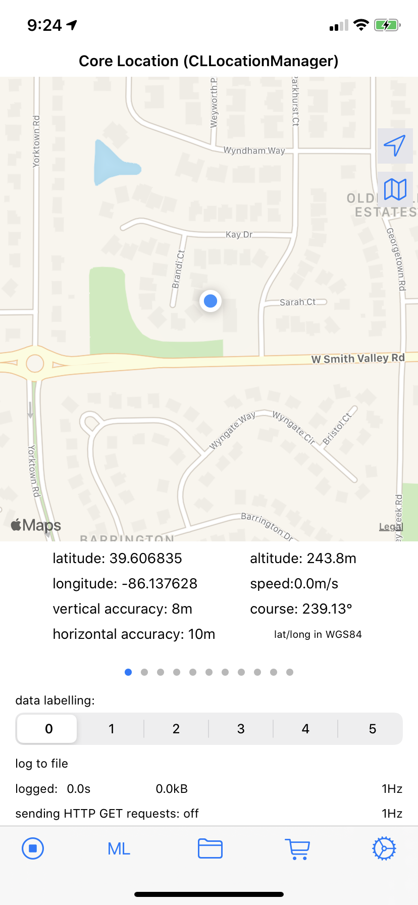
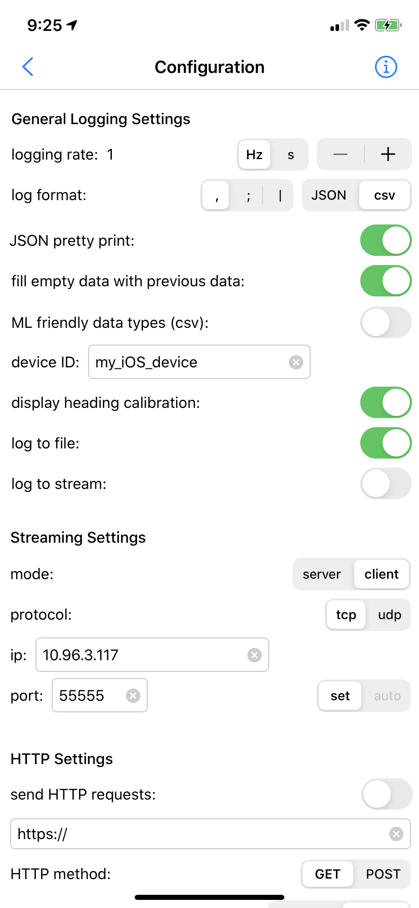
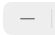
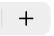
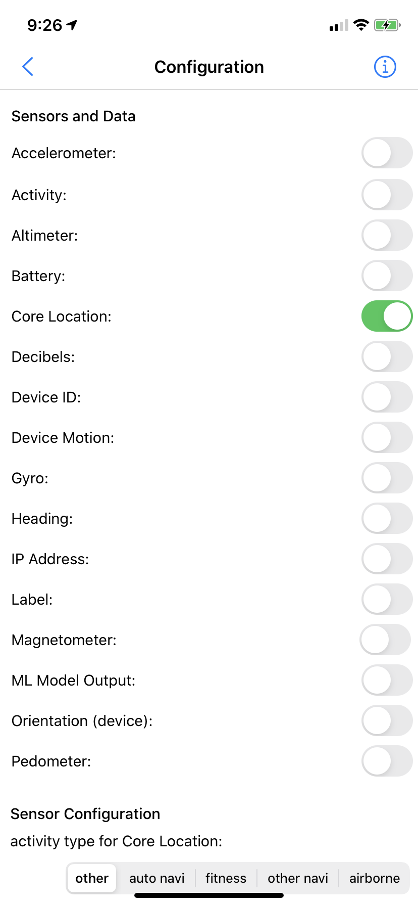
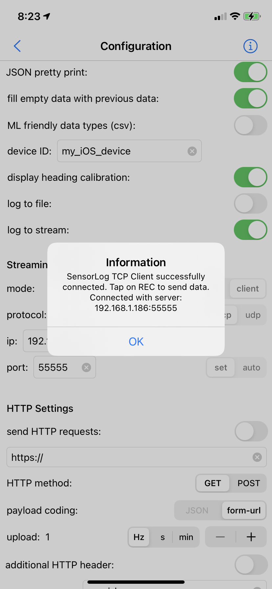

# Using a Socket Connector

## Table of Contents

* [Activate Input Data Connector for Socket](#activate-input-data-connector-for-socket)
* [Determine IP Address of ESP Server](#determine-ip-address-of-esp-server)
* [Configure SensorLog to Stream Information](#configure-sensorlog-to-stream-information)
* [Start the project on the SAS ESP Server](#start-the-project-on-the-sas-esp-server)
* [Connect SensorLog to ESP and Stream Data](#connect-sensorlog-to-esp-and-stream-data)

You can use the following steps to configure a live streaming connection between SensorLog and ESP.

## Activate Input Data Connector for Socket

You must activate the input data connector for the socket connector, and de-activate the connector for the csv file. 

1.	In ESP Studio, ensure the `sensor_log` project is open.

2.	Click the **inputGPS** window to select it.

3.	Expand **Input Data (Publisher) Connectors**.

    

    _Figure 1 - Input Data Connectors_

4.	Ensure the **Active** checkbox is selected for the `Socket_Connector`. Ensure the **Active** checkbox is not selected for the `Csv_Connector`.

5.	Expand **Subscriber Connectors**.

6.	Ensure the **Active** checkbox is selected for the `Position_Out_Connector`.

7.	Save your changes.

## Determine IP Address of ESP Server

You must know the IP address of the ESP server to make the connection. From a LINUX command line, type the following to display the IP address:

~~~
ip addr
~~~

This command will display all IP addresses associated on all network devices.

~~~
1: lo: <LOOPBACK,UP,LOWER_UP> mtu 65536 qdisc noqueue state UNKNOWN group default qlen 1000
    link/loopback 00:00:00:00:00:00 brd 00:00:00:00:00:00
    inet 127.0.0.1/8 scope host lo
       valid_lft forever preferred_lft forever
2: enp1s0: <BROADCAST,MULTICAST,UP,LOWER_UP> mtu 1500 qdisc fq_codel state UP group default qlen 1000
    link/ether 00:80:64:e0:7d:55 brd ff:ff:ff:ff:ff:ff
    inet 192.168.1.186/24 brd 192.168.1.255 scope global dynamic noprefixroute enp1s0
       valid_lft 70523sec preferred_lft 705
23sec
    inet6 2600:1700:7f91:20:5c4d:8471:fd53:b200/64 scope global temporary dynamic
       valid_lft 3560sec preferred_lft 3560sec
    inet6 2600:1700:7f91:20:381e:4884:88d7:78bb/64 scope global temporary deprecated dynamic
       valid_lft 3560sec preferred_lft 0sec
    inet6 2600:1700:7f91:20:74f6:8e15:f5af:3995/64 scope global temporary deprecated dynamic
       valid_lft 3560sec preferred_lft 0sec
    inet6 2600:1700:7f91:20:d4f5:93a0:25ca:2cbd/64 scope global temporary deprecated dynamic
       valid_lft 3560sec preferred_lft 0sec
    inet6 2600:1700:7f91:20:44a4:a73f:cb52:208a/64 scope global temporary deprecated dynamic
       valid_lft 3560sec preferred_lft 0sec
    inet6 2600:1700:7f91:20::49/128 scope global dynamic noprefixroute
       valid_lft 2145sec preferred_lft 2145sec
    inet6 2600:1700:7f91:20:48ac:a44a:4d05:d85e/64 scope global temporary deprecated dynamic
       valid_lft 3560sec preferred_lft 0sec
    inet6 2600:1700:7f91:20:607e:24b8:55d6:da0f/64 scope global temporary deprecated dynamic
       valid_lft 3560sec preferred_lft 0sec
    inet6 2600:1700:7f91:20:e6a:583:1ca3:e2f2/64 scope global dynamic mngtmpaddr noprefixroute
       valid_lft 3560sec preferred_lft 3560sec
    inet6 fe80::c1ad:8d72:4173:cdd3/64 scope link noprefixroute
       valid_lft forever preferred_lft forever
3: wlp2s0: <NO-CARRIER,BROADCAST,MULTICAST,UP> mtu 1500 qdisc mq state DOWN group default qlen 1000
    link/ether ac:fd:ce:27:1d:fc brd ff:ff:ff:ff:ff:ff
4: br-09fab59e86c0: <NO-CARRIER,BROADCAST,MULTICAST,UP> mtu 1500 qdisc noqueue state DOWN group default
    link/ether 02:42:1e:28:10:b7 brd ff:ff:ff:ff:ff:ff
    inet 172.21.0.1/16 brd 172.21.255.255 scope global br-09fab59e86c0
       valid_lft forever preferred_lft forever
5: br-3824eaeb0814: <NO-CARRIER,BROADCAST,MULTICAST,UP> mtu 1500 qdisc noqueue state DOWN group default
    link/ether 02:42:89:86:de:9d brd ff:ff:ff:ff:ff:ff
    inet 172.20.0.1/16 brd 172.20.255.255 scope global br-3824eaeb0814
       valid_lft forever preferred_lft forever
6: br-3d37fae691f5: <NO-CARRIER,BROADCAST,MULTICAST,UP> mtu 1500 qdisc noqueue state DOWN group default
    link/ether 02:42:34:22:b4:fb brd ff:ff:ff:ff:ff:ff
    inet 172.18.0.1/16 brd 172.18.255.255 scope global br-3d37fae691f5
       valid_lft forever preferred_lft forever
7: docker0: <NO-CARRIER,BROADCAST,MULTICAST,UP> mtu 1500 qdisc noqueue state DOWN group default
    link/ether 02:42:df:6f:a8:97 brd ff:ff:ff:ff:ff:ff
    inet 172.17.0.1/16 brd 172.17.255.255 scope global docker0
       valid_lft forever preferred_lft forever
~~~

Make a note of the IP address of the ethernet device. You will use this later in SensorLog.

## Configure SensorLog to Stream Information

You must configure SensorLog to act as a client in the socket connection and stream (publish) data to ESP.

_Figure 2 - SensorLog Home Screen_

1. From the SensorLog home screen, tap  (Configuration button) to open the Configuration screen.

   

   _Figure 2 - SensorLog Configuration Screen_

2. Configure the **General Logging Settings** as follows:

   - Tap either  or  to adjust the **logging rate**. One or two hertz is a recommended setting.
   -    Ensure **csv** and the comma are selected for the **log format**.

3. Configure the **Streaming Settings** as follows:

   - Ensure **client** is selected as the **mode**.
   - Ensure **tcp** is selected as the **protocol**.
   - Enter the appropriate IP address in the **ip** field.
   - Enter **55555** as the **port**.
     

4. Scroll down to the **Sensors and Data** section and ensure **Core Location** is the only toggle selected.

   > NOTE: Do not turn on log to stream at this time.

   

   _Figure 3 - SensorLog Sensors and Data Screen_

## Start the project on the SAS ESP Server

The server component must be running before you start the client. Start the project on the ESP server at the [command line](../../doc/command_line/readme.md) or by using [SAS ESP Studio](../../doc/esp_studio/readme.md).

## Connect SensorLog to ESP and Stream Data

You can start the client session in SensorLog once the project is running on the ESP server.

1. From the SensorLog Configuration screen, turn on **log to stream**. SensorLog connects to the server and displays the following message.

   

   _Figure 4 - SensorLog Connection Message_

2.	Tap **OK** to close the Information screen.

3.	Tap  to return to the home screen.

4. Tap  to start data streaming.

The project should now be running with live data streaming from SensorLog to the ESP project. You can open output file `sensorLog_output.csv` to verify the connection.
